# hi: high-level design

How hi (Human Intent) works, end to end, as of 0.8.0, the 1.0 release candidate. Every statement here is traceable to the code, the workflows or the existing docs, and links to the file it comes from rather than pasting it. Where this repository cannot answer a question, the answer says **Unknown:**.

This file is the map between three others. [DECISIONS.md](../DECISIONS.md) is why each choice was made, [HI-1.md](../HI-1.md) is the contract a 1.0 freezes, and `src/` is what actually runs. If this document and the code disagree, the code is right and this file is the bug. It is also published, with its diagrams rendered, at [corvidlabs.github.io/hi/architecture](https://corvidlabs.github.io/hi/architecture/).

Contents: [1. Purpose](#1-purpose) · [2. Context](#2-context) · [3. Components](#3-components) · [4. Key flows](#4-key-flows) · [5. Data](#5-data) · [6. Runtime and deployment](#6-runtime-and-deployment) · [7. Security and trust boundaries](#7-security-and-trust-boundaries) · [8. Failure modes and limits](#8-failure-modes-and-limits) · [9. Decisions](#9-decisions) · [10. Glossary](#10-glossary)

## 1. Purpose

hi is a single Rust binary that keeps acceptance criteria as plain human sentences, each under a permanent id its author chose (`SEND-1.a`), in ordinary markdown files under `hi/`. A person, or a coding agent working for one, writes down what somebody wants before anything is built. Tickets (`hi issue`), agent payloads (`hi export`) and a readable page (`hi view`) are generated from those sentences; specs are written downstream from the export by an agent and checked by [spec-sync](https://github.com/CorvidLabs/spec-sync). The problem it solves is translation loss: by the time intent is a spec it has become modules and contracts, and what a person wanted is gone ([README.md](../README.md), [INTENT.md](../INTENT.md)).

hi holds intent and identity and nothing else. It stores no state, tracks no lifecycle, binds no evidence, has no prose linter, and never fails a build because a criterion is unproven ([DECISIONS.md](../DECISIONS.md) §1, §5, §9). It has four dependencies (`clap`, `serde`, `serde_json`, `anyhow`, in [Cargo.toml](../Cargo.toml)), no config file, no init step, and no network access of its own.

## 2. Context

hi runs inside one repository at a time and reads and writes only files in it. The single exception is `hi issue --create`, which starts `gh` as a child process.

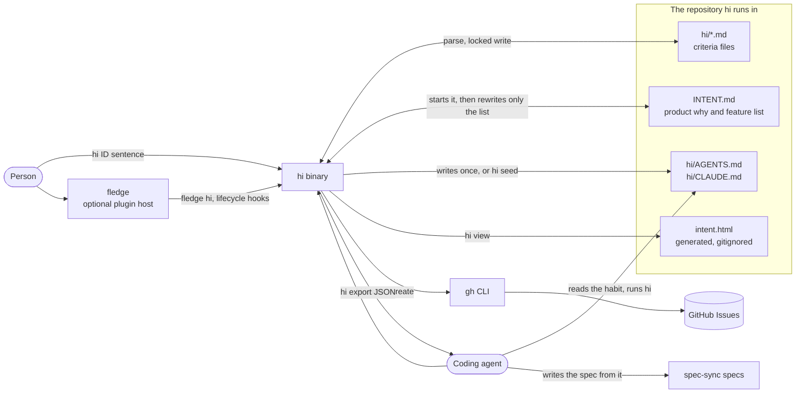

- **Where a workspace is.** `Workspace::find` walks up from the current directory (or `--root`) and stops at the first directory whose `hi/` holds a markdown file with a `hi:` key in its frontmatter, or at the first directory with a `.git`, whichever comes first. A `hi/` that is something else, such as `public/locales/hi/` for Hindi, is ignored. With neither above it, hi refuses to run ([src/workspace.rs](../src/workspace.rs), `hi: CAPTURE-6`, `CAPTURE-10`).
- **Who the users are.** People at a terminal, and increasingly agents capturing in bulk: DECISIONS.md §26 records twelve repositories and about 1,700 criteria, most of them generated.
- **What is downstream.** hi does not write specs and has no coupling to spec-sync. `hi export` is the handoff, and an agent does the translation (DECISIONS.md §6, "Generation").

## 3. Components

One crate, one binary. Each module owns one thing, and `main.rs` owns none of them ([CLAUDE.md](../CLAUDE.md), "Architecture").

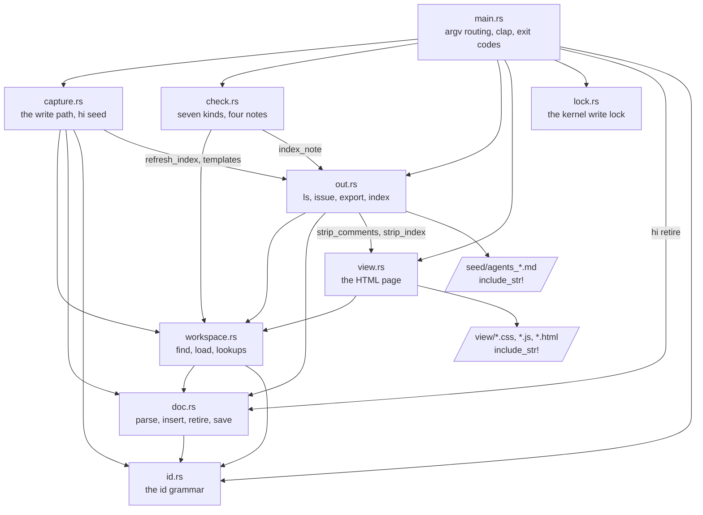

| Module | Owns | Entry points | Spec |
|---|---|---|---|
| [src/main.rs](../src/main.rs) | Routing an id-shaped first word to capture before clap sees it, the `Command` enum, taking the lock for every write verb, printing, exit codes | `main`, `peel_root`, `run_capture`, `run`, `run_index` | [specs/main](../specs/main/main.spec.md) |
| [src/id.rs](../src/id.rs) | The id grammar: family charset, strict number and letter alternation, parent and descendant relations | `Id::parse`, `Id::parent`, `Id::is_descendant_of`, `looks_like_id` | [specs/id](../specs/id/id.spec.md) |
| [src/doc.rs](../src/doc.rs) | Parsing one `hi/*.md` into a `Doc`, and every edit to one: surgical insertion, retirement, the read-back check, atomic save | `Doc::parse`, `Doc::insert`, `Doc::retire`, `Doc::set_retired_reason`, `Doc::save`, `write_atomically`, `one_line` | [specs/doc](../specs/doc/doc.spec.md) |
| [src/workspace.rs](../src/workspace.rs) | Finding `hi/`, loading every doc, and lookups across them. Writes nothing | `Workspace::find`, `load`, `find_id`, `strays`, `find_stray`, `next_free`, `family_declarers` | [specs/workspace](../specs/workspace/workspace.spec.md) |
| [src/lock.rs](../src/lock.rs) | One writer per repository, held by the kernel: `flock` on unix, `LockFileEx` on Windows | `acquire`, `Guard` | [specs/workspace](../specs/workspace/workspace.spec.md) |
| [src/capture.rs](../src/capture.rs) | Whether a capture may happen and which file receives it; starting `INTENT.md`, `hi/AGENTS.md` and `hi/CLAUDE.md`; `hi seed` | `capture`, `seed_agent_files` | [specs/capture](../specs/capture/capture.spec.md) |
| [src/check.rs](../src/check.rs) | Structural validation only: the seven `Kind`s, the four `NoteKind`s, the `Report` | `run`, `Report::ok` | [specs/check](../specs/check/check.spec.md) |
| [src/out.rs](../src/out.rs) | The generated outputs: `ls`, `issue`, `export`, the `INTENT.md` feature list, and the `hi/AGENTS.md` templates | `ls`, `issue`, `export`, `write_index`, `refresh_index`, `index_note`, `agent_instructions` | [specs/out](../specs/out/out.spec.md) |
| [src/view.rs](../src/view.rs) | The HTML page, and the only markdown rendering in the crate | `render`, `write`, `inline_markdown`, `strip_comments`, `strip_index` | [specs/view](../specs/view/view.spec.md) |
| [src/promise.rs](../src/promise.rs) | Test only (`#[cfg(test)]`): random capture, retire and hand-edit sequences over files hi did not write | property tests | [specs/promise](../specs/promise/promise.spec.md) |

The page's stylesheet, script, theme script, pre-paint snippet and theme toggle live in [src/view/](../src/view/) and are compiled in with `include_str!`, never built with `format!`. The three `hi/AGENTS.md` templates earlier releases shipped live in [src/seed/](../src/seed/) and are compiled in the same way, so `hi seed` can recognise them ([.gitattributes](../.gitattributes) keeps them LF on every platform). The fledge plugin is two shell scripts in [bin/](../bin/) and a [plugin.toml](../plugin.toml), described in [4.6](#46-the-fledge-plugin-and-its-hooks).

Every module has a spec under [specs/](../specs/) with requirements that cite the criterion they serve (`hi: CAPTURE-3`), and `specsync check` covers every line of `src/`. The two test targets have specs too: [tests/cli.rs](../tests/cli.rs) drives the real binary for argv routing, exit codes and the stdout and stderr split ([specs/cli](../specs/cli/cli.spec.md)), and [tests/promise.rs](../tests/promise.rs) runs concurrent processes against the promise.

## 4. Key flows

### 4.1 Routing a command line

Capture is the default verb, so `main` decides before clap does. It reads the arguments as OS strings, so a non-UTF-8 argument becomes an error rather than a panic.

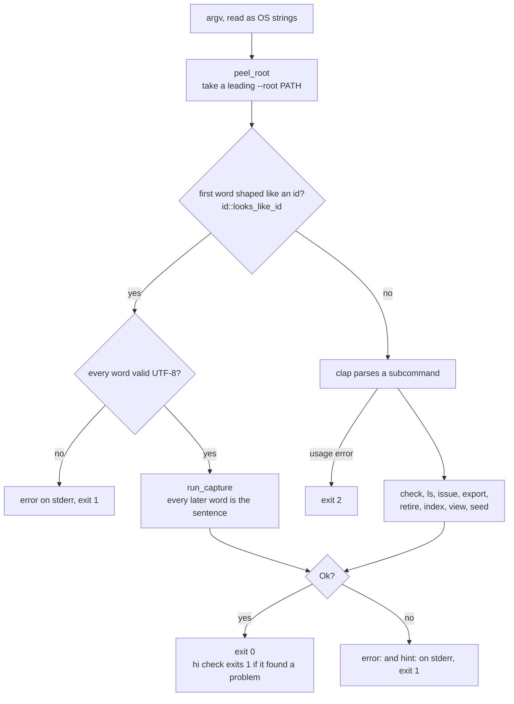

- Only a **leading** `--root` is a flag. Once the id appears, every word after it is the sentence, including one that looks like a flag (`hi: CAPTURE-8`).
- `looks_like_id` accepts a lowercase family on purpose, so `send-2` routes to capture and is refused by `Id::parse` with a reason instead of being read as a subcommand or as prose (`hi: CHECK-2.d`). The first level has to start with a digit, which is what keeps `spec-sync` and `well-formed` from looking like ids.
- The exit codes are frozen in [HI-1.md](../HI-1.md): 0 did what was asked, 1 could not (a structural problem, an operational failure, or a refusal), 2 is clap's usage error.

### 4.2 Capture

`hi SEND-2 "it reaches them and the mark changes to sent"` adds exactly one criterion to exactly one file. The rule is that a new id just works and an existing id refuses ([src/capture.rs](../src/capture.rs), `hi: CAPTURE-2`, `CAPTURE-3`).

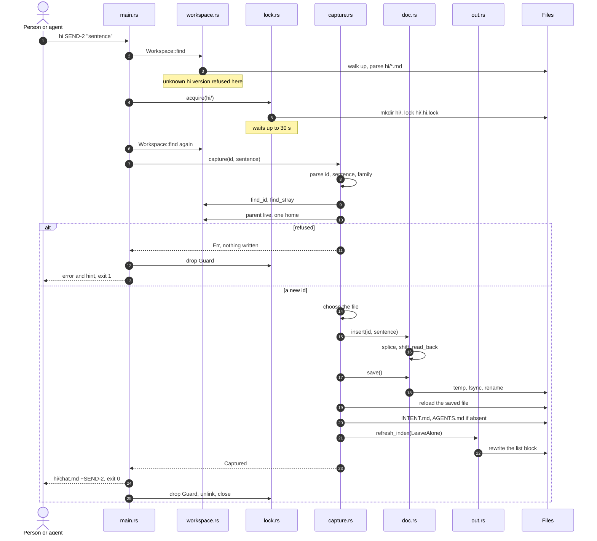

The order is the design, and each step was a defect first (DECISIONS.md §26, §31 to §36):

1. **Refuse before writing.** Every refusal happens before anything touches disk, and `Doc::insert` restores its in-memory copy on failure, so a refused capture leaves the repository byte for byte unchanged (`hi: CAPTURE-5`). The refusals, in order: an id that does not parse; an empty sentence; `AGENTS` or `CLAUDE` as a family, since those name hi's own files; an id already live or retired anywhere (with `next free is SEND-3` as the hint, computed over live and retired ids, and omitted at the `u32` ceiling); an id written somewhere hi cannot read it (`hi: CAPTURE-14`); a case whose parent is missing or retired (`hi: CAPTURE-4`); a new top-level id in a family two files both declare (`hi: CAPTURE-16`).
2. **Lock, then read again.** The workspace loaded before the lock can be stale by the time the lock is granted, so both write verbs load it again once they hold it (DECISIONS.md §33, `hi: RETIRE-7`).
3. **Choose the file.** A case goes to the file its parent lives in, whatever the frontmatter says (`hi: CAPTURE-4.a`). Otherwise the family's file: the first path-sorted file that declares it, then the first that uses it. Otherwise a new file, `hi/<family>.md` lowercased with `_` written as `-`, built in memory from `doc::new_file_text` and not saved until the insert has succeeded (`hi: CAPTURE-2.a`).
4. **Insert, and read it back.** See [5.3](#53-id-rules-append-first-and-retire) for where the line goes. `Doc::read_back` parses the buffer it is about to save and refuses it unless the id is readable under `## Criteria`, every id the file already made readable still is, every other criterion keeps its section, sentence and reason, and nothing new is stranded (DECISIONS.md §31, §35, `hi: FILE-22`).
5. **Save atomically.** `write_atomically` writes `.<name>.<pid>.hi-tmp` beside the target, flushes and `fsync`s it, then renames it over the target, so a failed write leaves the original intact (`hi: FILE-8`). The pid keeps concurrent writers off each other's scratch file (`hi: FILE-18`).
6. **Side writes, best effort.** Only after the criterion is on disk: `INTENT.md` if the repository has none (`hi: INDEX-3`), `hi/AGENTS.md` if absent, and `hi/CLAUDE.md` beside it as a symlink to `AGENTS.md` or, where a symlink cannot be made, a one-line `See @AGENTS.md` pointer (DECISIONS.md §27). Then the feature list is refreshed ([4.5](#45-the-feature-list-in-intentmd)). None of these can turn a capture that stored its criterion into a failure (`hi: INDEX-4.a`).

### 4.3 Retire

`hi retire <ID> [reason]` moves a criterion and every case under it into `## Retired`, where the id stays reserved forever ([src/main.rs](../src/main.rs) `Command::Retire`, [src/doc.rs](../src/doc.rs) `retire_inner`).

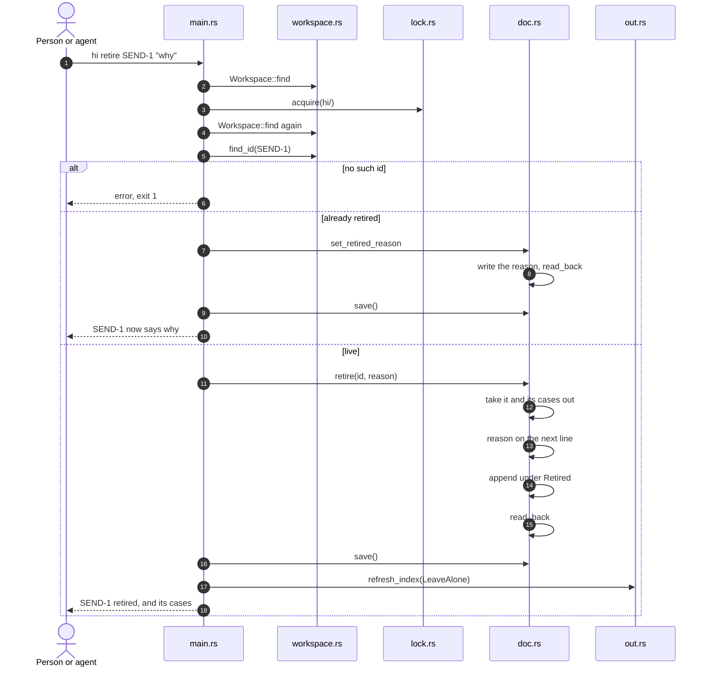

- Cases go with their parent, so nothing is orphaned, and they are named in the output because a case can belong to a different concern than its parent (`hi: RETIRE-1.a`, `RETIRE-1.d`).
- The reason is written directly under the retired criterion's own line, indented two more spaces, as `retired: <reason>`. Written after the whole block it would parse as a note on the last case (comment in `retire_inner`).
- The end of `## Retired` is found through `fence_map`, the same fence reading the parser uses, so a `## Retired` inside somebody's fenced example is not mistaken for the section (`hi: RETIRE-5`, `FILE-22.b`).
- Adding a reason to an already retired criterion does not change the live count, so that path does not refresh the feature list.

### 4.4 Export

`hi export [FAMILY | file | ID]` is the handoff to an agent: pretty-printed JSON with the `## Intent` prose attached ([src/out.rs](../src/out.rs) `export`, envelope frozen in [HI-1.md](../HI-1.md)).

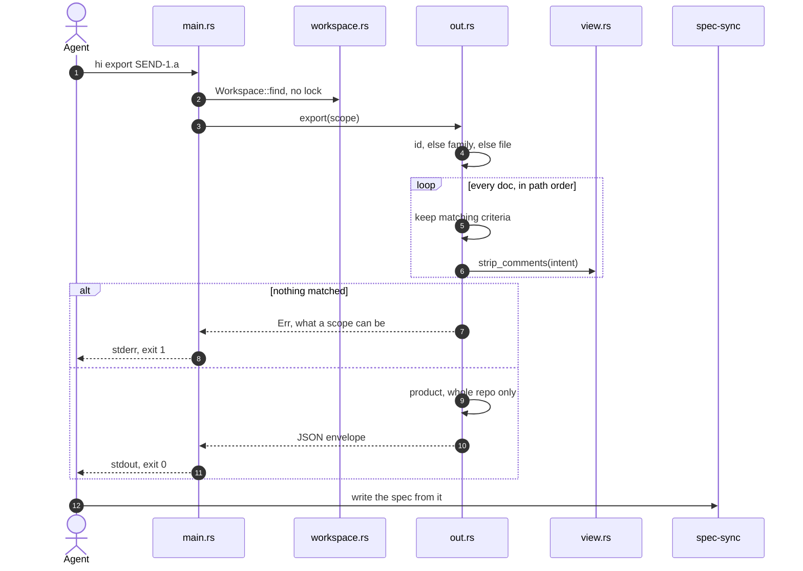

- **Scope precedence.** An id wins whenever the scope parses as one, whatever a frontmatter declares, then a family, then a file named by stem (`chat`), file name (`chat.md`) or path (`hi/chat.md`). A family has no hyphen and a criteria file starts lowercase, so the three rarely overlap (DECISIONS.md §40, `hi: EXPORT-7`).
- **An id scope** carries the criterion, every case beneath it and every criterion it sits under, so every `parent` in the payload names an entry in the payload when `hi check` passes (`hi: EXPORT-7.a`). For hi's own `hi/`, DECISIONS.md §40 measures roughly 10,000 tokens whole against about 300 for one criterion.
- **The prose** in `intent` and `product` has `<!-- -->` comments removed, so the starter prompts hi wrote never reach an agent as if a person had (`hi: EXPORT-5`). `product` also drops the generated feature list, the title and the `## Features` heading (`view::strip_index`), and is omitted rather than `null` when there is none.
- **Two versions.** `"hi"` is the file format's version (`doc::FORMAT_VERSION`) and `"export"` is the envelope's (`ENVELOPE_VERSION`). Both are 1 and free to move apart (`hi: EXPORT-6`).

### 4.5 The feature list in INTENT.md

`INTENT.md` at the root holds the product-level why in the author's words, and a feature list hi generates between two whole-line markers, `<!-- hi:index -->` and `<!-- /hi:index -->`. The prose is never touched. Three verbs rewrite the list, all through `out::write_index` and all under the write lock: capture and `hi retire` with `Absent::LeaveAlone`, and `hi index` with `Absent::Install` ([src/out.rs](../src/out.rs), DECISIONS.md §30, §32).

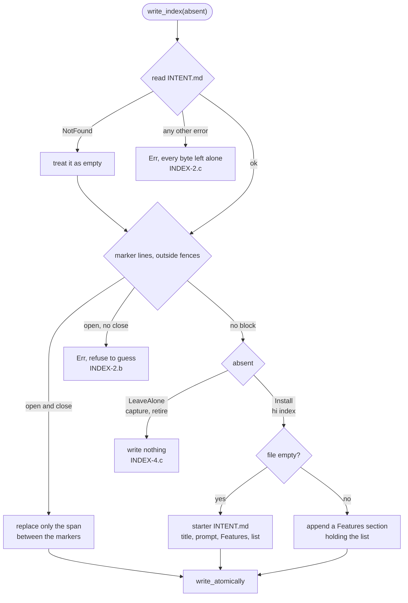

- **The list** is one line per criteria file in path order, `- [chat](hi/chat.md): SEND, RECEIPT (12 criteria)`, counting live criteria only. Families come from the frontmatter, or from use if none are declared. An empty `hi/` gives `- nothing captured yet` (`out::index_block`).
- **Markers are whole lines outside fences**, so a person can quote them in prose or in a fenced example without hi writing the list into it (`hi: INDEX-2.a`).
- **Best effort on the automatic path.** `refresh_index` turns every failure into a string that capture and retire print on stderr as a `note:` and exit 0 anyway (`hi: INDEX-4.a`). It takes no lock of its own, because its callers already hold the one lock and it is not reentrant.
- **Deleting the list is respected.** The refresh installs nothing, so a person who removed the block keeps it removed until they run `hi index` (`hi: INDEX-4.c`). A first capture still leaves a complete file, because `capture::start_product_intent` writes the starter with the list already in it.
- **`hi check` notes the rest.** `index-behind` when the block differs from what would be generated, which after 0.7.0 has one cause, a criterion typed in by hand (`hi: INDEX-4.b`); `index-markers` when an opening marker has no close. Neither is a problem and neither moves the exit code.
- **This repository also gates on it.** [scripts/index-is-current.sh](../scripts/index-is-current.sh) regenerates the list and fails if that changed anything, because this repository publishes its own index.

### 4.6 The fledge plugin and its hooks

The same binary is available as `fledge hi` for anyone who uses [fledge](https://github.com/CorvidLabs/fledge). The plugin is [plugin.toml](../plugin.toml), a command shim [bin/fledge-hi](../bin/fledge-hi), and a lifecycle hook [bin/fledge-hi-nudge](../bin/fledge-hi-nudge) (DECISIONS.md §7, §28).

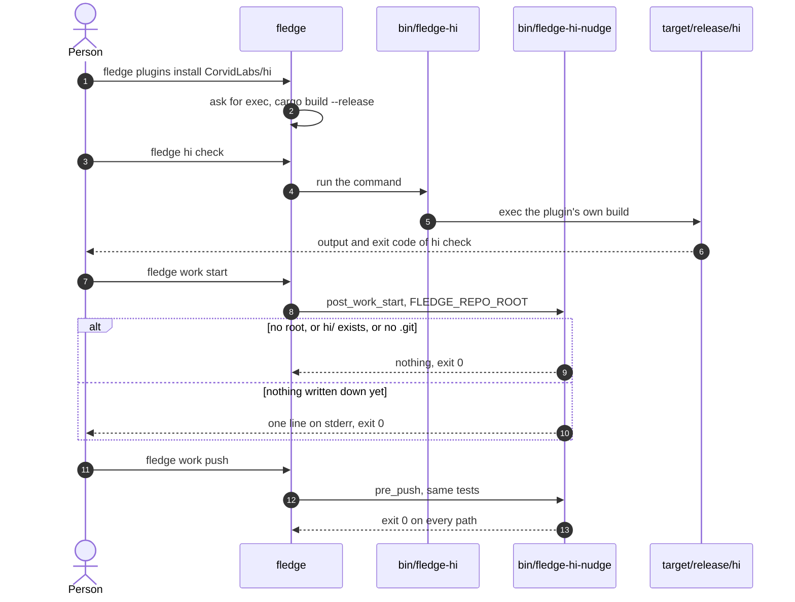

- **The shim never resolves `hi` through `PATH`.** Another project ships a `hi` that is a coding agent with shell access (DECISIONS.md §13), so `bin/fledge-hi` follows its own symlinks to the plugin directory and execs `target/release/hi` or `target/debug/hi`, or exits 1 with a build hint if neither exists.
- **The nudge cannot fail your command.** A hook that exits non-zero aborts the command that ran it, so every path ends at `exit 0`. It writes nothing, and it prints to stderr only, because `fledge work start --json` owns stdout (`hi: HABIT-4`, `HABIT-4.a`, `HABIT-4.b`). [scripts/nudge-behaves.sh](../scripts/nudge-behaves.sh) asserts the exit status before the wording.
- **It needs `FLEDGE_REPO_ROOT`.** fledge runs a hook from the plugin's own directory, so the repository is only knowable from that variable, added in CorvidLabs/fledge#520. The README records that it is merged but not in a release yet, and that v1.7.2 and earlier skip the hooks. Without it the nudge stays quiet rather than guess.
- **Capabilities.** `exec = true`, because fledge skips the hooks of a plugin that has not declared it; `store = false`; `metadata = true`.

### 4.7 The other verbs

| Verb | What it does | Lock | Source |
|---|---|---|---|
| `hi check [--json]` | Every structural problem in every readable file, sorted by file and line, then the notes. Exit 1 exactly when `problems` is non-empty | none | [src/check.rs](../src/check.rs) |
| `hi ls [--family F] [--retired]` | Each file, then its criteria indented two spaces per depth, sentences exactly as written; retired ones marked `(retired)` | none | [src/out.rs](../src/out.rs) `ls` |
| `hi issue <ID> [--create] [--repo O/N]` | A ticket: the sentence as the title, `hi: <ID>` as the backlink, its cases nested, and the file's intent with soft wraps joined. Refuses an unknown or retired id. `--create` runs `gh issue create` | none | [src/out.rs](../src/out.rs) `issue` |
| `hi index` | The feature list, installing the section if there is none | yes | [src/main.rs](../src/main.rs) `run_index` |
| `hi view [--out FILE]` | One self-contained HTML page, `intent.html` at the root by default | none, decided | [src/view.rs](../src/view.rs) |
| `hi seed` | Write `hi/AGENTS.md` when missing, replace it when it is a template hi shipped, refuse when a person edited it | yes | [src/capture.rs](../src/capture.rs) `seed_agent_files` |

**`hi check`** finds seven kinds, all structural, frozen by HI-1.md: `duplicate-id`, `orphan-case`, `retired-collision`, `unparseable-id`, `undeclared-family`, `stray-criterion`, `duplicate-family`. It adds up to four notes that never move the exit code: `no-product-why`, `index-behind`, `index-markers`, `unexplained-retirement` (only a retirement's root needs a reason; a case retired with its parent does not). `--json` serialises every `Kind` and `NoteKind` through the same `code()` the terminal prints, so there is one list of names (`hi: CHECK-6`). A file hi cannot read is an operational failure, exit 1, never a kind (`hi: CAPTURE-15`, DECISIONS.md §36).

**`hi issue`** joins lines that were only wrapped, because GitHub renders an issue body with hard line breaks on, and keeps blank lines, lists, quotes, headings, tables, rules, fences and explicit hard breaks (`out::unwrap_soft_breaks`, `hi: ISSUE-7`). That is the rendering only: the file it read from is never reflowed (`hi: FILE-4`). `--create` passes the title and body to `gh` as separate arguments, with no shell in between.

**`hi view`** builds the page in memory and writes it whole with `fs::write`. It takes no lock by decision: it never reads the page it is about to write, the page is derived and gitignored, and the lock would make a read verb create `hi/` (comment on `Command::View` in [src/main.rs](../src/main.rs), `hi: INDEX-5`). The page is named after the first `# ` heading in `INTENT.md` (`hi: VIEW-11`), opens with that file's prose, and has a sticky rail listing every feature with its count, search with highlighting, sort by id or family, keyboard movement, a copyable link per id, retired criteria folded away, and a light and dark theme. It fetches nothing: the CSS, the script and the brand kit's theme files are inlined, and with scripting off every criterion is still visible and the controls stay hidden (`hi: VIEW-2`, `VIEW-10`). [scripts/view-behaves.sh](../scripts/view-behaves.sh) opens a generated page in headless Chrome and asserts on what is visible (`hi: VIEW-20`).

**`hi seed`** compares `hi/AGENTS.md` with the current text and with the three older templates in [src/seed/](../src/seed/), after folding a BOM and CRLF. Missing is written, with `hi/CLAUDE.md` beside it; current is left alone; an older template is rewritten atomically, keeping its line endings; anything else is refused with exit 1 (`hi: HABIT-6`, HI-1.md "`hi/AGENTS.md`"). Capture only ever writes the file when it is absent.

## 5. Data

hi has no database and keeps nothing outside the repository. Its whole state is the files below, and state it could derive, such as whether a criterion is built, is never written down (DECISIONS.md §5).

### 5.1 Files on disk

```text
repo/
  INTENT.md            product-level why (yours) + the generated feature list
  intent.html          hi view output; generated, gitignore it
  hi/
    chat.md            criteria files: lowercase *.md directly inside hi/
    billing.md
    AGENTS.md          hi's own, uppercase, not read as criteria; written once
    CLAUDE.md          symlink to AGENTS.md, or a one-line pointer
    .hi.lock           present only while a writer holds the lock
    .chat.md.4242.hi-tmp   present only during an atomic write
```

Every write hi makes:

| Path | Written by | When | How | Under the lock |
|---|---|---|---|---|
| `hi/<family>.md` | `Doc::save` | capture, retire | `write_atomically`: temp, fsync, rename | yes |
| `INTENT.md`, whole | `capture::start_product_intent` | the first capture, when absent | `fs::write`, best effort | yes |
| `INTENT.md`, the list | `out::write_index` | capture and retire (refresh), `hi index` | `write_atomically` | yes |
| `hi/AGENTS.md` | `capture::start_agent_files` | a capture, when absent | `fs::write`, best effort | yes |
| `hi/AGENTS.md` | `capture::seed_agent_files` | `hi seed` | `fs::write` when missing, `write_atomically` when replacing a template | yes |
| `hi/CLAUDE.md` | `capture::link_to_agents` | beside a new `AGENTS.md` | symlink, else `See @AGENTS.md` | yes |
| `hi/.hi.lock` | `lock::acquire` | every write verb | opened, pid written for people, unlinked on release | it is the lock |
| `intent.html` or `--out` | `view::write` | `hi view` | `fs::write`, the whole file | no |

hi writes inside `hi/` and at `INTENT.md` and `intent.html`, and nowhere else. A block in the repository's own `CLAUDE.md` was considered and refused (DECISIONS.md §27).

### 5.2 Parsing HI/1

A criteria file is markdown a person could have typed ([HI-1.md](../HI-1.md), "The file"). `Doc::parse` keeps every original line so edits can be surgical ([src/doc.rs](../src/doc.rs)):

1. **Before anything else.** A leading BOM is stripped (`hi: FILE-11`). The file's line ending is whichever of CRLF and LF it uses more, and is written back the same way (`hi: FILE-10`), and whether it ended with a newline is remembered.
2. **Frontmatter, by hand.** No YAML library. If the first line is `---` and a closing `---` exists, `key: value` lines are read for `hi` (quotes and a trailing ` #` comment dropped), `families` or `family` (inline `[SEND, RECEIPT]` or a YAML block list, remembering which, `hi: FILE-7`) and `owner`, which is prose and unread. An opening `---` with no closing one is not frontmatter. `hi:` absent, empty or `1` is HI/1; any other value makes `Workspace::load` refuse the whole repository by name, in front of every read and every write (`hi: FILE-25`, `FILE-25.a`).
3. **The body, one line at a time**, as below. Section headings are matched case-insensitively; `###` is neither a title nor a section.

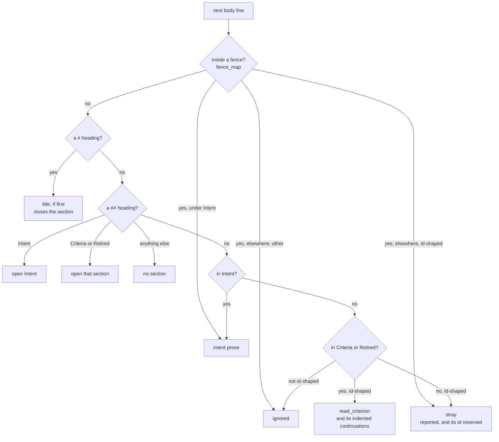

- **Id-shaped** means an optional `- `, `* ` or `+ ` bullet, then a first token that passes `looks_like_id` once `*` and `_` emphasis are trimmed. So `- **SEND-1**  sentence`, `SEND-1  sentence` and `* SEND-1 sentence` are all read (`hi: FILE-14`).
- **A criterion's continuations** are the following lines that are indented, not blank, not id-shaped and not a `#` or `##` heading. A continuation starting `retired:` is the retirement note; any other is joined to the sentence with one space. Refusing to swallow an indented heading keeps `read_criterion` agreeing with `parse_body` about where a section starts (DECISIONS.md §35).
- **A fence** is a run of three or more backticks or tildes, closed by a run of the same character at least as long. It is an example rather than structure everywhere hi reads markdown, and `fence_map` is the one state machine the parser and every write path share (`hi: FILE-9`, DECISIONS.md §31).
- **What the parser records** besides the criteria: the title (first `# `), the `## Intent` prose, the line just past the end of `## Criteria` (where a new family appends), the `## Criteria` heading's line, and every stray line with its token.

`Workspace::load` then reads every `*.md` directly inside `hi/`, sorted by path. A name starting with an uppercase letter is hi's own, such as `AGENTS.md`, and is kept aside in `skipped` instead of parsed. It is not ignored: `Workspace::strays` scans it for criterion-shaped lines outside fences, and fails rather than answers if it cannot read one (`hi: FILE-20`, `CAPTURE-15`). That one lookup is what `check` reports from and what capture refuses from, so the two cannot disagree (DECISIONS.md §32).

### 5.3 Id rules: append-first, and retire

The grammar is in [src/id.rs](../src/id.rs) and frozen in HI-1.md:

- **A family** is `[A-Z][A-Z0-9_]*`, then a hyphen, then a dotted path of levels.
- **Levels alternate strictly**: number, letter, number, letter. `SEND-1.a.1.b` is valid; `SEND-1.a.b` is refused with the depth and what it expected (`hi: ID-3`, `ID-4`). Letters are cases of their parent; numbers are steps inside it.
- **A number** is decimal, fits in 32 bits, and has no leading zero, so `SEND-007` is refused rather than normalised to `SEND-7`, which would give one line two names (`hi: ID-1.c`). **A letter level** is one or more of `a-z`.
- **The parent** of an id is the id with its last level removed; `is_descendant_of` compares family and level prefixes.

**Append-first.** hi never renumbers. `Doc::insertion_point` decides where a new line goes, in this order: after the parent and every existing descendant of it; else after the last criterion of the same family; else, for a family new to this file, at the end of `## Criteria` after a blank line; else below the `## Criteria` heading. A file with no `## Criteria` gets one first (`hi: CAPTURE-7`). The line is always `  `-per-depth indentation, then `- **ID**  sentence`, on one line however long, with whitespace collapsed (`doc::render_criterion`, `hi: FILE-1.b`, `FILE-6`). Nothing else in the file changes, apart from the frontmatter `families` line when the family is new to the file, rewritten in the style the file already used (`hi: FILE-4.a`, `FILE-7`).

**Retire.** Retiring does not free a number: `next_free` counts live and retired ids alike, so after `SEND-3` retires the next free is still `SEND-4` (DECISIONS.md §8.3). Every string hi writes into a file, sentence or reason, goes through `doc::one_line`, so a reason with a newline and a criterion-shaped line in it cannot forge a second criterion (`hi: RETIRE-6`).

**The one promise.** hi's own verbs never reuse an id, and a criterion they reported as saved is readable in the section they named. `read_back` is the postcondition that holds each write to it, the kernel lock stops two writers from losing each other's work, and [src/promise.rs](../src/promise.rs) and [tests/promise.rs](../tests/promise.rs) generate the sequences nobody wrote a case for (HI-1.md "The promise", DECISIONS.md §26). What hi cannot stop is a person renumbering a file in an editor, or two branches choosing the same id against the tree each started from. That is why permanence is a convention over the merged tree, and why `hi check` on the merged tree is what proves it (DECISIONS.md §37).

### 5.4 An id's standing, which is not a lifecycle

hi tracks no lifecycle: there is no draft, agreed or met (DECISIONS.md §5). What an id does have is a standing in the files, and every verb reads it the same way.

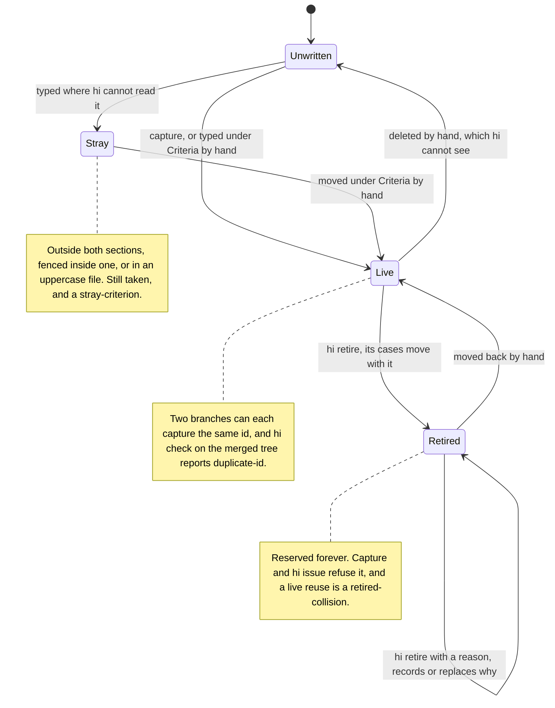

A case can only be captured under a live parent. Live, retired and stray are all **taken**: `Workspace::find_id` covers the first two and `Workspace::find_stray` the third, and capture refuses an id in any of them. Hand edits are allowed by the format (`hi: FILE-14`), and the transitions marked "by hand" are the ones hi can only report afterwards, never prevent.

### 5.5 In memory

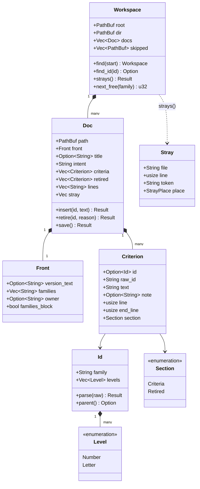

`Criterion.id` is `None` when the token was id-shaped but invalid; the raw token and the `IdError` are kept, and `check` reports it as `unparseable-id` rather than letting the line read as prose. `Doc::insert` splices lines and shifts every tracked index but does not add the new criterion to `criteria`, which is why capture reloads the saved file before anything counts (comment in `insert_inner`).

### 5.6 Output shapes

| Output | Shape | Frozen by |
|---|---|---|
| `hi export` | `{ hi, export, scope, product?, files: [{ file, title?, intent, families, criteria, retired }] }`, each criterion `{ id, text, depth, parent, retired? }` | HI-1.md "Export envelope", at `"export": 1` |
| `hi check --json` | `{ notes: [{ kind, message }], files, criteria, retired, families, problems: [{ kind, file, line, id, message }] }` | the kind and note codes, HI-1.md "Check kinds" |
| `hi check` | problems grouped by file as `  line:code  message`, then `N criteria · N families · N files · N retired`, then `note:` lines | nothing; wording is free |
| `hi issue` | `## <sentence>`, then `hi: <ID>`, `Cases:` as a nested list, `---`, `Intent for <file>:` and the prose | nothing |
| `hi view` | one HTML file; `<li>` per criterion with `data-id`, `data-family`, `data-file`, `data-retired`, `data-find` | nothing; the page chrome is not frozen |

Paths in every output use forward slashes on every platform (`Workspace::rel`, `hi: FILE-12`).

## 6. Runtime and deployment

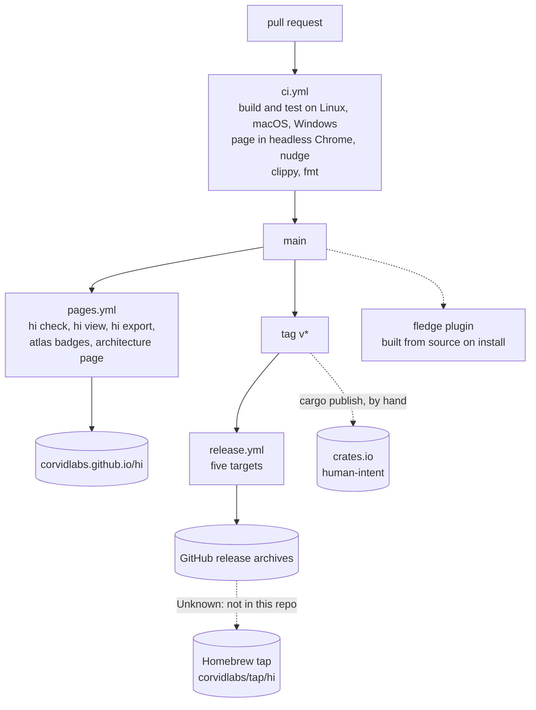

- **Build.** `cargo build --release`, edition 2024, one binary named `hi` from the crate `human-intent`, because `hi` on crates.io belongs to an unrelated library (DECISIONS.md §7, §13). The published crate excludes `specs/`, `docs/`, `.specsync/`, `.fledge/`, `.github/` and `intent.html` ([Cargo.toml](../Cargo.toml)).
- **The gate.** `fledge lanes run verify` runs, in order: `fmt` and `lint` in parallel, `test`, `view-behaves`, `intent` (`cargo run -- check`), `index`, `spec` (`specsync check`), `nudge-behaves`, `plugin-validate` ([fledge.toml](../fledge.toml)).
- **CI.** [ci.yml](../.github/workflows/ci.yml) on every pull request and every push to `main`: build and test on Ubuntu, macOS and Windows; the page in headless Chrome and the nudge script on Ubuntu; clippy with `-D warnings` and `cargo fmt --check`. The token is `contents: read`.
- **Release.** [release.yml](../.github/workflows/release.yml) fires on a `v*` tag, so tagging is the release. It builds `x86_64` and `aarch64` Linux (the latter on a native arm64 runner), `x86_64` and `aarch64` macOS, and `x86_64` Windows, each packaged with `LICENSE`, `THIRD-PARTY-LICENSES.md` and `README.md`, and attaches them to the GitHub release. `cargo publish` is run by hand afterwards, from a clean tree, and the registry is checked, because 0.2.4 and 0.2.5 were tagged and never published ([CLAUDE.md](../CLAUDE.md), "Releasing").
- **Pages.** [pages.yml](../.github/workflows/pages.yml) runs on a push to `main` that touches `hi/`, `INTENT.md`, `src/`, `specs/`, this document or its page template, and on demand. It builds hi, refuses to publish unless `hi check` passes, renders `hi view` to `site/index.html` and `site/intent.html`, writes `hi export` to `site/intent.json`, renders Atlas coverage badges into `site/badges/` with `CorvidLabs/fledge-plugin-atlas@v1`, renders this document into `site/architecture/`, and deploys with one retry for a transient Pages failure. The intent page is hi's own output, so the demo is the artifact rather than a mock-up of it (`hi: VIEW-19`, `VIEW-19.a`).
- **The architecture page** is [docs/site/architecture.html](site/architecture.html) with this file converted to HTML by `marked` and spliced in. Unlike the intent page it loads Mermaid from jsdelivr to draw the diagrams, which is why it is a separate page: the intent page fetches nothing, by criterion (`hi: VIEW-2`).
- **Distribution.** `cargo install human-intent`; archives from the release page; `brew install corvidlabs/tap/hi`; `fledge plugins install CorvidLabs/hi`, which builds from source and so needs cargo. **Unknown:** how the Homebrew formula is bumped; the tap is not in this repository. **Unknown:** the source of the docs site at [corvidlabs.xyz/hi](https://corvidlabs.xyz/hi), which is also not in this repository.
- **Running.** Nothing runs between commands. There is no daemon, no cache, no server and no configuration; every invocation finds the workspace, parses every file in `hi/`, does one thing and exits.

## 7. Security and trust boundaries

- **No secrets and no network.** hi reads no environment variables for itself, holds no token, and opens no socket. `hi issue --create` is the one path out of the repository, and it runs the user's own `gh` with the user's own authentication, passing the title and body as separate arguments with no shell in between ([src/out.rs](../src/out.rs)).
- **Files are untrusted text.** hi reads markdown a person, an agent or another branch wrote. The parser never executes anything and accepts what a person could type, and the page escapes before it interprets: `view::inline_markdown` HTML-escapes the whole string first and only then scans for `code`, bold, italic and links. Reversing that order is a vulnerability, not a refactor (`hi: VIEW-3.a`, [CLAUDE.md](../CLAUDE.md)). Links render only for `http://`, `https://` and root-relative `/` targets; anything else, such as a `javascript:` URL, stays text.
- **Input cannot forge structure.** Every string hi writes into a file goes through `doc::one_line`, so a sentence or a retire reason with newlines in it cannot become a second criterion or a heading (`hi: RETIRE-6`). Every write reads itself back and is refused if anything other than what the verb named changed (DECISIONS.md §31).
- **A different format is not guessed at.** A file that declares a `hi:` version this binary does not read stops every verb before anything is written (`hi: FILE-25`).
- **The plugin runs only its own binary.** `bin/fledge-hi` never resolves `hi` through `PATH`, because a different `hi` on a person's path can be a coding agent with shell access (DECISIONS.md §13). The plugin declares `exec` because its hook runs a script; the hook writes nothing and exits 0.
- **Concurrency is the kernel's.** Only a process that holds the OS lock on `hi/.hi.lock` writes, and hi never decides that another process has finished (DECISIONS.md §34). The pid in the file is for a person and nothing reads it back.
- **CI tokens.** `ci.yml` has `contents: read`; `pages.yml` has `contents: read`, `pages: write` and `id-token: write`; `release.yml` has `contents: write` to attach archives. The Pages build runs `hi check` before it publishes anything.

## 8. Failure modes and limits

| What happens | How hi behaves | Where |
|---|---|---|
| Another writer holds the lock | Waits, retrying every 20 ms, for up to 30 s, then refuses with exit 1 and says the lock belongs to a running process. It never tells you to delete the file | `lock::acquire`, `PATIENCE`, `RETRY` |
| A writer was killed mid-capture | The kernel dropped its lock when the process died; the next writer takes it with nothing to clean up (`hi: FILE-23`) | [src/lock.rs](../src/lock.rs) |
| A writer is slow or stopped | Nothing takes its lock away while it is alive (`hi: FILE-24`) | [src/lock.rs](../src/lock.rs) |
| Windows reports access denied during a lock handoff | Treated as transient for 500 ms, then a real failure | `GRACE` |
| The filesystem cannot lock, such as some network shares | Fails closed with a hint to use a local checkout | `lock::acquire` |
| A platform that is neither unix nor Windows | Exclusive create is the lock; it is not released if hi is killed, so the hint says to delete it. hi does not ship for such a platform | the fallback `os` module |
| A write fails partway | The temp file is removed and the original is untouched (`hi: FILE-8`) | `doc::write_atomically` |
| A write would land where hi cannot read it back, such as below an unclosed fence | Refused, nothing written, with the fence's line in the hint (`hi: FILE-22.a`) | `Doc::read_back` |
| `INTENT.md`, `hi/AGENTS.md` or the list cannot be written after a capture | The capture still succeeds; a list failure is a `note:` on stderr (`hi: INDEX-4.a`) | [src/capture.rs](../src/capture.rs) |
| `INTENT.md` exists but cannot be read, such as one invalid UTF-8 byte | Left alone and reported; only a missing file may be created (`hi: INDEX-2.c`, DECISIONS.md §32) | `out::write_index` |
| A file hi skips cannot be read | `check` and capture both fail with exit 1 rather than answer "free" about an id they could not look for (`hi: CAPTURE-15`) | `Workspace::strays` |
| A file declares another format version | Every verb refuses before anything is written (`hi: FILE-25.a`) | `Workspace::load` |
| An empty `hi/*.md` | Refused with "no frontmatter" rather than a panic (`hi: CAPTURE-12`) | `Doc::insert_inner` |
| A non-UTF-8 argument | An error, not a backtrace (`hi: CAPTURE-1.c`) | `main` |
| The top of the id range | `next_free` saturates at `u32::MAX` and the hint is dropped rather than wrong (`hi: CAPTURE-13`) | `Workspace::next_free` |
| Two branches captured the same id | Both merge cleanly in git; `hi check` on the merged tree reports `duplicate-id` (DECISIONS.md §37) | [src/check.rs](../src/check.rs) |
| `hi view` races a capture | The page may be one criterion behind until the next run, and no id depends on it. It is written with `fs::write`, so a failed write can leave a partial page until the next run | `view::write` |
| `gh` is missing or not signed in | `hi issue --create` fails with exit 1 and names `gh`; printing a ticket needs nothing | `out::issue` |

**Limits.** Every verb parses every criteria file on every run, and capture holds one lock for the whole repository, not per file. DECISIONS.md §26 says the lock can narrow to the file if that proves too coarse. **Unknown:** there is no measured ceiling on files or criteria; this repository's own 168 criteria in 7 files, and about 1,700 across twelve adopter repositories, are the only recorded sizes. The id promise holds against the tree hi ran on, not across unmerged branches (HI-1.md).

## 9. Decisions

[DECISIONS.md](../DECISIONS.md) is the record, and most things that look missing are listed there as decisions. [HI-1.md](../HI-1.md) is the contract 1.0 freezes, and [docs/1.0-plan.md](1.0-plan.md) is the readiness review that led to it. [CHANGELOG.md](../CHANGELOG.md) has the history, and [docs/ac-formats.html](ac-formats.html) is the pre-code survey of acceptance-criteria formats, to be read as history.

| Decision | In short | Where |
|---|---|---|
| Intent and identity only | No state, no lifecycle, no evidence binding, no CI gate on intent | §1, §5, §9 |
| Hand-written, permanent ids | Speakable beats allocated; collisions are caught by `hi check`, accepted deliberately | §4, §26, §37 |
| A criterion is one list item on one line | Bare lines render as one paragraph; the list is the point | §10.1, §12 |
| A criterion is a plain sentence | The `As a <role>,` prefix was required for four releases and removed | §14, §24 |
| No prose linter | Requirement-smell detection measures about 59% precision | §9, README |
| The crate is `human-intent`, the command `hi` | `hi` on crates.io is taken; the command name is shared on purpose | §7, §13 |
| The page is one self-contained file in the brand kit | No network, works from an email attachment | §10.3, §25 |
| The one promise, scoped to hi's own verbs | Four ways hi broke it, and what they changed | §26 |
| hi writes `hi/AGENTS.md` once, and `hi seed` migrates it | The agent learns the habit from a file in `hi/` | §27, §38, §39 |
| First contact comes from fledge | A user-global plugin reaches repositories with no `hi/` | §28 |
| One paragraph is one line | Only a blank line is a break; `hi issue` unwraps, files are never reflowed | §29 |
| The feature list keeps itself current | Capture and retire refresh it; deleting it is respected | §30, §32 |
| Writes read themselves back | The write path and the parse path share one fence reading | §31, §35 |
| The lock belongs to the kernel | Age and heartbeat were both guesses | §33, §34 |
| Unreadable is not absent | A lookup that cannot see is a failure, not a "free" | §36 |
| Seven check kinds, frozen as a policy | An eighth is a 2.0 | §38, §39, HI-1.md |
| An id is an export scope | A context window is a budget | §40 |

## 10. Glossary

- **Criterion.** One plain sentence about what somebody wants, under an id, on one line. It says what the thing should be, not what it currently does.
- **Case.** A criterion whose last level is a letter: another branch of its parent (`SEND-1.a`).
- **Step.** A criterion below the top whose last level is a number: an ordered detail inside its parent (`SEND-1.a.1`).
- **Family.** The uppercase part before the hyphen (`SEND`). Declared in a file's frontmatter. One file can hold several families, and a family belongs in exactly one file, or `hi check` reports `duplicate-family`.
- **Live, retired, stray.** Under `## Criteria`; under `## Retired`; criterion-shaped but where hi cannot read it. All three are taken.
- **Intent.** The `## Intent` prose of a feature file: why the feature exists, in the author's words.
- **Product-level why.** The prose in `INTENT.md`, above any one feature.
- **Feature list, index.** The generated block between `<!-- hi:index -->` and `<!-- /hi:index -->` in `INTENT.md`.
- **Workspace.** The directory holding `hi/`, found by walking up to a `hi/` with hi files in it or to a `.git`.
- **HI/1.** The only file format version this binary reads or writes, named by `hi: 1` in frontmatter.
- **Envelope.** The shape of `hi export`'s JSON, versioned separately as `"export": 1`.
- **Kind, note.** A kind is one of the seven structural problems that fail `hi check`. A note is something worth saying that never moves the exit code.
- **Read-back.** The check every write makes on the buffer it is about to save before saving it.
- **Seed template.** A `hi/AGENTS.md` text some release of hi shipped, which `hi seed` may replace.
- **Nudge.** The fledge hook that says one line in a repository with nothing written down.
